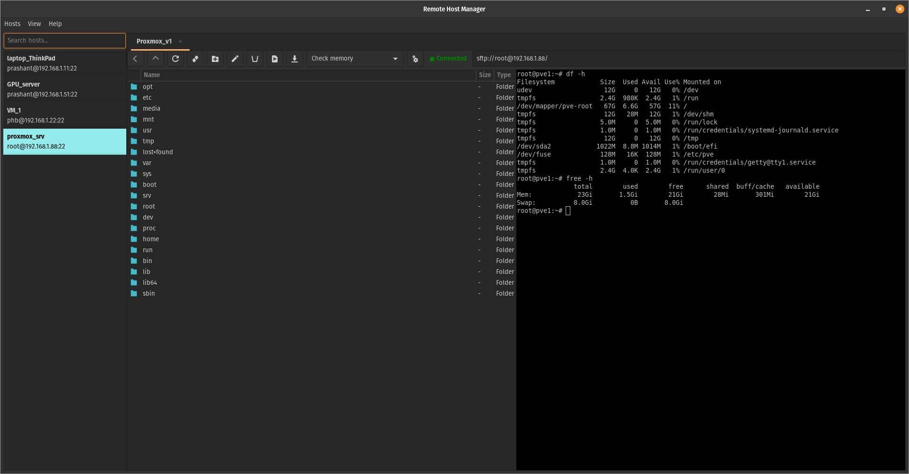

# Remote Host Manager

A lightweight Linux desktop application for managing remote servers from one clean GTK interface. I built Remote Host Manager to make managing my local homelab machines and cloud servers easier from a single Linux desktop application.

It is built using **C + GTK3 + GLib/GIO + VTE** and is designed for Linux desktop environments.

---

## Overview

Remote Host Manager is a simple but useful tool for developers, system administrators, DevOps engineers, homelab users, and Linux power users who regularly work with multiple remote machines. This helps you save SSH hosts, open remote terminal sessions, browse remote files over SFTP, and perform basic file operations without repeatedly typing SSH/SFTP commands manually.

Instead of opening many terminal windows and remembering different SSH commands, you can keep your remote hosts saved in one place and open them as tabs.

Each host tab provides:

- Integrated SSH terminal
- Remote SFTP file browser
- Saved host management
- Basic remote file operations
- Multiple host tabs
- Clean GTK desktop interface

---

## Quick Install


### Download and Install Remote Host Manager

```bash
wget -O remote-host-manager \
  https://github.com/PrashantBand/remote-host-manager/releases/latest/download/remote-host-manager

chmod +x remote-host-manager

sudo mv remote-host-manager /usr/local/bin/remote-host-manager
```

- Run the Application

```bash
remote-host-manager
```


### Direct Run Without Global Install

```bash
wget -O remote-host-manager \
  https://github.com/PrashantBand/remote-host-manager/releases/latest/download/remote-host-manager

chmod +x remote-host-manager

./remote-host-manager
```


### Install required runtime dependencies first (Optional if failed)

-  Ubuntu / Debian / Pop!_OS / Linux Mint

```bash
sudo apt update
sudo apt install -y \
  libgtk-3-0 \
  libglib2.0-0 \
  libvte-2.91-0 \
  gvfs \
  gvfs-backends \
  openssh-client \
  adwaita-icon-theme
```

---

## Demo Screenshots 



---

## Why This Tool Is Useful

Managing remote Linux servers usually involves multiple repetitive steps:

```bash
ssh user@server-ip
sftp user@server-ip
scp local-file user@server-ip:/path
```

This becomes inconvenient when you work with several machines.

Remote Host Manager solves this by giving you:

* One place to save all server connection details
* One-click remote host opening
* SSH terminal and file browser in the same tab
* Remote directory navigation with Back / Up / Refresh
* Upload and download support
* Rename, delete, and create-folder actions
* Host search and sidebar
* Menu-based desktop workflow

It is especially useful for:

* Linux server administration
* VPS management
* Homelab management
* Development servers
* Raspberry Pi / edge device access
* Internal company servers
* Remote file inspection
* Quick SSH troubleshooting

---

## Features

### Host Management

* Add saved hosts
* Edit saved hosts
* Remove saved hosts
* Search saved hosts
* Toggle host sidebar
* Prevent duplicate host tabs

### Remote Terminal

* Opens SSH session inside the app
* Uses VTE terminal widget
* Supports multiple remote terminal tabs
* Automatically updates connection status
* Reconnect option available

### Remote File Browser

* Browse remote server files using SFTP via GIO/GVFS
* Double-click folders to enter directories
* Back button for previous directory
* Up button for parent directory
* Refresh current directory
* Remote path entry support

### File Operations

* Create new folder
* Rename selected file/folder
* Delete selected file/folder
* Upload local file to remote directory
* Download selected remote file
* File size display
* Folder/file type display

### Application Menu

* Hosts menu

  * Add Host
  * Edit Selected Host
  * Remove Selected Host
  * Quit

* View menu

  * Toggle Host Sidebar

* Help menu

  * About Remote Host Manager

### Preset Commands

The application supports configurable command presets such as:

* Check disk
* Check memory
* Kernel info
* Uptime

These are loaded from a local preset configuration file.

---

## Supported Platforms

Remote Host Manager is built for **Linux desktop systems**.

It depends on:

* GTK 3
* GLib / GIO
* GVFS SFTP backend
* VTE terminal widget
* OpenSSH client

### Recommended Distros

| Distribution           |      Status | Notes                                     |
| ---------------------- | ----------: | ----------------------------------------- |
| Ubuntu 22.04 LTS       | Recommended | Good GTK3/VTE/GVFS support                |
| Ubuntu 24.04 LTS       | Recommended | Good GTK3/VTE/GVFS support                |
| Pop!_OS 22.04          | Recommended | Ubuntu-based, tested style target         |
| Linux Mint 21.x / 22.x | Recommended | Ubuntu-based                              |
| Debian 12              |   Supported | May need dependency installation          |
| Fedora Workstation     |   Supported | Package names differ                      |
| Arch Linux / Manjaro   |   Supported | Rolling packages, dependency names differ |

### Desktop Environments

Recommended:

* GNOME
* Cinnamon
* XFCE
* MATE
* KDE Plasma

The app should work on most Linux desktops where GTK3, GVFS, and VTE are available.

### Not Supported

This project is not designed for:

* Windows
* macOS
* Android
* Server-only/headless Linux without desktop session
* Minimal Linux installs without GTK/GVFS

---

## Runtime Requirements

Even if you download the ready binary, your system still needs these runtime components:

### Ubuntu / Debian / Pop!_OS / Linux Mint

```bash
sudo apt update
sudo apt install -y \
  libgtk-3-0 \
  libglib2.0-0 \
  libvte-2.91-0 \
  gvfs \
  gvfs-backends \
  openssh-client \
  adwaita-icon-theme
```

### Fedora

```bash
sudo dnf install -y \
  gtk3 \
  glib2 \
  vte291 \
  gvfs \
  gvfs-sftp \
  openssh-clients \
  adwaita-icon-theme
```

### Arch Linux / Manjaro

```bash
sudo pacman -S --needed \
  gtk3 \
  glib2 \
  vte3 \
  gvfs \
  gvfs-sftp \
  openssh \
  adwaita-icon-theme
```

---

## Quick Start Using Prebuilt Binary

A prebuilt Linux executable can be downloaded directly from the release page:

```text
https://github.com/PrashantBand/remote-host-manager/releases
```

---

### Option 1: Download Latest Release using `curl`

```bash
curl -L \
  -o remote_host_manager \
  https://github.com/PrashantBand/remote-host-manager/releases/latest/download/remote-host-manager

chmod +x remote_host_manager

./remote_host_manager
```

---

### Option 2: Download Latest Release using `wget`

```bash
wget -O remote_host_manager \
  https://github.com/PrashantBand/remote-host-manager/releases/latest/download/remote-host-manager

chmod +x remote_host_manager

./remote_host_manager
```

---


## Recommended Binary Install

To make the binary available globally:

```bash
sudo cp dist/remote_host_manager /usr/local/bin/remote-host-manager
sudo chmod +x /usr/local/bin/remote-host-manager
```

Then run:

```bash
remote-host-manager
```

---

## Build From Source

### Install Build Dependencies

#### Ubuntu / Debian / Pop!_OS / Linux Mint

```bash
sudo apt update
sudo apt install -y \
  build-essential \
  pkg-config \
  libgtk-3-dev \
  libglib2.0-dev \
  libvte-2.91-dev \
  gvfs \
  gvfs-backends \
  openssh-client \
  adwaita-icon-theme
```

#### Fedora

```bash
sudo dnf install -y \
  gcc \
  make \
  pkgconf-pkg-config \
  gtk3-devel \
  glib2-devel \
  vte291-devel \
  gvfs \
  gvfs-sftp \
  openssh-clients \
  adwaita-icon-theme
```

#### Arch Linux / Manjaro

```bash
sudo pacman -S --needed \
  base-devel \
  pkgconf \
  gtk3 \
  glib2 \
  vte3 \
  gvfs \
  gvfs-sftp \
  openssh \
  adwaita-icon-theme
```

---

## Compile

From the project root:

```bash
gcc main.c app.c host_config.c host_dialog.c session_tab.c util.c preset_config.c \
  -o remote_host_manager \
  -Wall -Wextra \
  $(pkg-config --cflags --libs gtk+-3.0 gio-2.0 glib-2.0 vte-2.91)
```

Run:

```bash
./remote_host_manager
```

---

## How To Use

### 1. Start the Application

```bash
./remote_host_manager
```

Or, if installed globally:

```bash
remote-host-manager
```

---

### 2. Add a Host

Open:

```text
Hosts → Add Host
```

Enter:

* Label
* Host/IP
* Username
* SSH port

Example:

```text
Label: Production Server
Host/IP: 192.168.1.50
Username: ubuntu
Port: 22
```

---

### 3. Open a Remote Host

Double-click a saved host from the left sidebar.

The app will open a new tab with:

* Remote file browser on the left
* SSH terminal on the right

---

### 4. Browse Remote Files

In the file browser:

* Double-click a folder to enter it
* Use `Back` to return to previous directory
* Use `Up` to move to parent directory
* Use `Refresh` to reload the current directory

---

### 5. Use Remote Terminal

The terminal opens an SSH session using the selected host details.

You can run normal Linux commands:

```bash
ls -la
df -h
free -h
systemctl status nginx
```

---

### 6. Upload Files

Select the target remote directory, then click:

```text
Upload
```

Choose a local file. It will be copied to the current remote directory.

---

### 7. Download Files

Select a remote file, then click:

```text
Download
```

Choose a local destination folder.

Note: Folder download is not implemented in the first version.

---

### 8. Create Remote Folder

Open the target remote directory, then click:

```text
New Folder
```

Enter the folder name.

---

### 9. Rename File or Folder

Select a remote item, then click:

```text
Rename
```

Enter the new name.

---

### 10. Delete File or Folder

Select a remote item, then click:

```text
Delete
```

Confirm the delete action.

---

## Keyboard Shortcuts

| Shortcut   | Action               |
| ---------- | -------------------- |
| `Ctrl + N` | Add Host             |
| `Ctrl + E` | Edit Selected Host   |
| `Delete`   | Remove Selected Host |
| `Ctrl + B` | Toggle Host Sidebar  |
| `Ctrl + Q` | Quit                 |
| `F1`       | About                |

---

## Configuration Files

The app stores configuration under the user config directory.

Usually:

```text
~/.config/remote_host_manager/
```

Files:

```text
hosts.ini
presets.ini
```

### Hosts Configuration

Saved hosts are stored in:

```text
~/.config/remote_host_manager/hosts.ini
```

### Preset Commands

Preset commands are stored in:

```text
~/.config/remote_host_manager/presets.ini
```

Default presets may include:

```text
Check disk      -> df -h
Check memory    -> free -h
Kernel info     -> uname -a
Uptime          -> uptime
```

---

## Important Notes About SFTP

Remote file browsing uses **GIO/GVFS SFTP**.

If file browsing does not work, make sure GVFS SFTP support is installed.

On Ubuntu/Debian-based systems:

```bash
sudo apt install gvfs gvfs-backends
```

You can also test SFTP mounting manually:

```bash
gio mount sftp://user@host:22/
```

If this works, the app should also be able to browse that remote host.

---

## SSH Authentication

The application uses your system SSH client.

Supported authentication depends on your local SSH setup:

* Password-based SSH
* SSH key-based login
* SSH agent
* Existing `~/.ssh/config`
* Known hosts

For the best experience, configure SSH keys:

```bash
ssh-copy-id user@host
```

Then verify:

```bash
ssh user@host
```

---

## Troubleshooting

### File browser does not open remote folders

Install GVFS SFTP support:

```bash
sudo apt install gvfs gvfs-backends
```

Test manually:

```bash
gio mount sftp://user@host:22/
```

---

### Terminal opens but SFTP browser fails

This usually means SSH works but GVFS SFTP backend is missing or not running.

Install:

```bash
sudo apt install gvfs gvfs-backends
```

Then restart your desktop session or log out and log back in.

---

### Icons are missing

Install Adwaita icon theme:

```bash
sudo apt install adwaita-icon-theme
```

---

### Permission denied while connecting

Verify SSH access manually:

```bash
ssh user@host
```

Also check:

```bash
~/.ssh/config
~/.ssh/id_rsa
~/.ssh/id_ed25519
```

---

### Binary does not run

Make it executable:

```bash
chmod +x remote_host_manager
```

Check missing shared libraries:

```bash
ldd ./remote_host_manager
```

Install missing runtime packages.

---

## Build Release Binary

Create a `dist/` folder:

```bash
mkdir -p dist
```

Compile directly into `dist/`:

```bash
gcc main.c app.c host_config.c host_dialog.c session_tab.c util.c preset_config.c \
  -o dist/remote_host_manager \
  -Wall -Wextra \
  $(pkg-config --cflags --libs gtk+-3.0 gio-2.0 glib-2.0 vte-2.91)
```

Make executable:

```bash
chmod +x dist/remote_host_manager
```

Generate checksum:

```bash
sha256sum dist/remote_host_manager > dist/remote_host_manager.sha256
```

---

## Current Limitations

* Linux desktop only
* Folder download is not implemented yet
* No built-in SSH key manager
* No SCP batch transfer UI yet
* No server grouping/tags yet
* No embedded file editor yet
* No dark theme customization yet unless provided by system theme

---

## Future Improvements

Planned or possible improvements:

* Dark theme styling
* Host groups and tags
* Favorite directories
* Remote file editor
* Drag-and-drop upload
* Folder download support
* Multi-file operations
* Terminal command presets editor
* Connection status badges
* SSH config import
* Encrypted host storage
* AppImage package
* `.deb` package
* Flatpak package

---


## License

Apache License 2.0

Copyright © 2026 Prashant Band

---

## Author

**Prashant Band**

Remote Host Manager is developed as a lightweight Linux desktop utility for practical remote server management.

---

## Project Status

Early version / active development.

The current version is usable for saved SSH host management, remote terminal access, SFTP file browsing, and basic remote file operations.